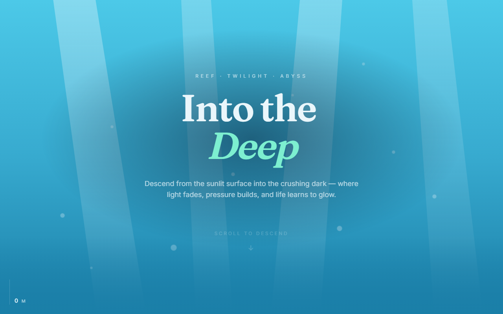
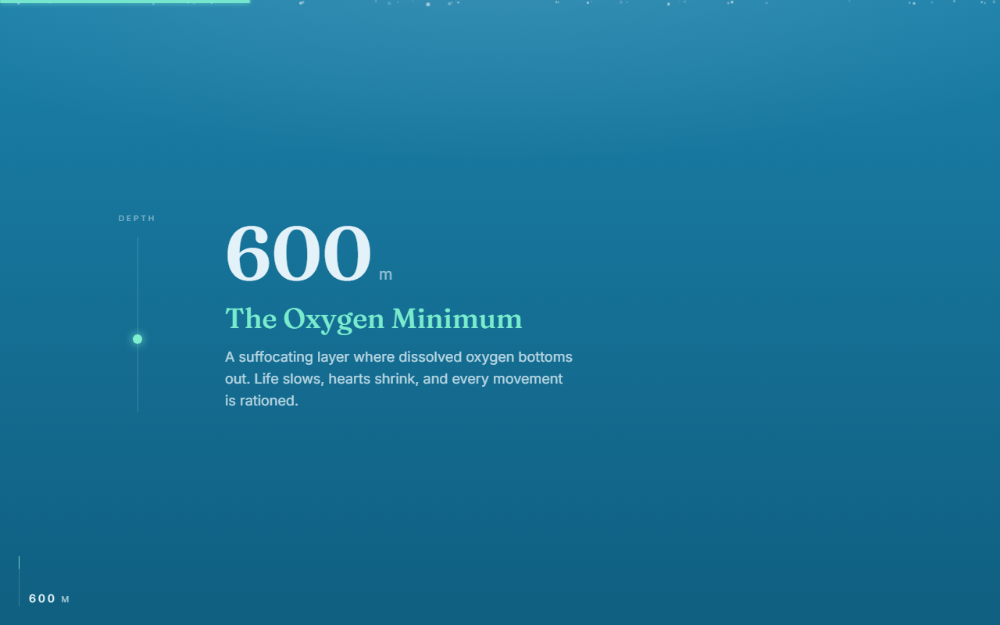
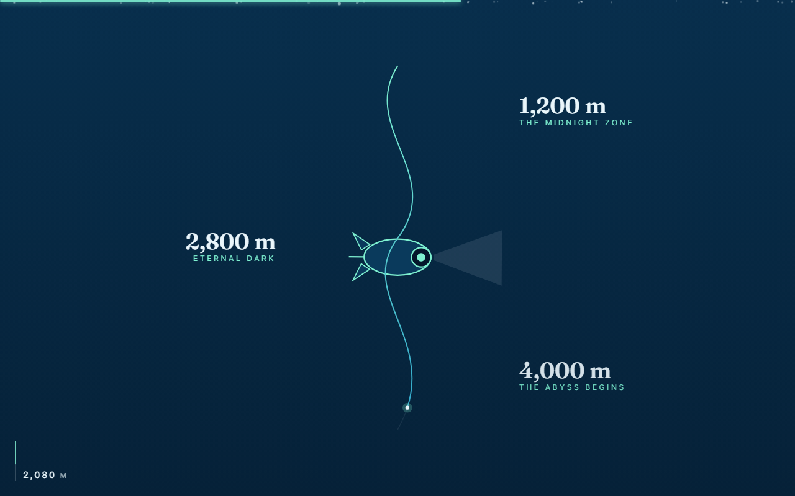
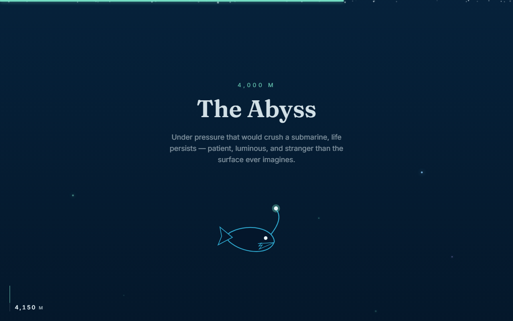
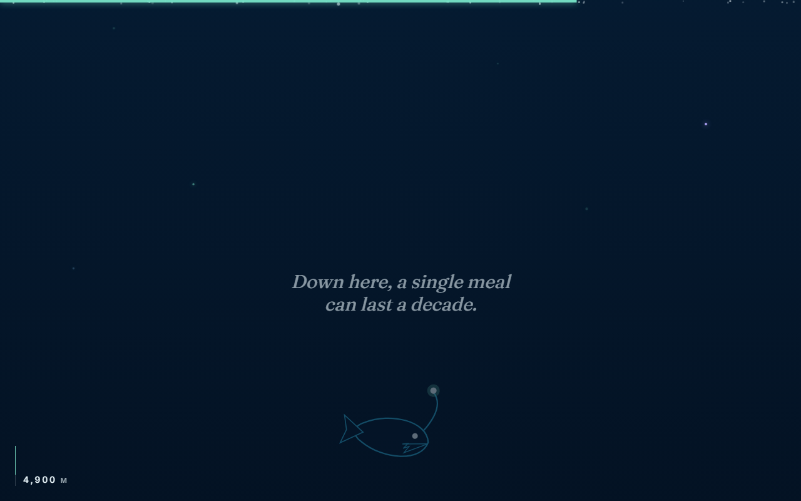
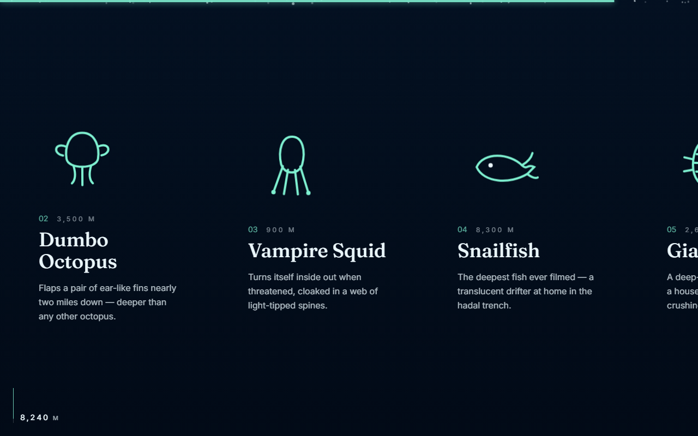
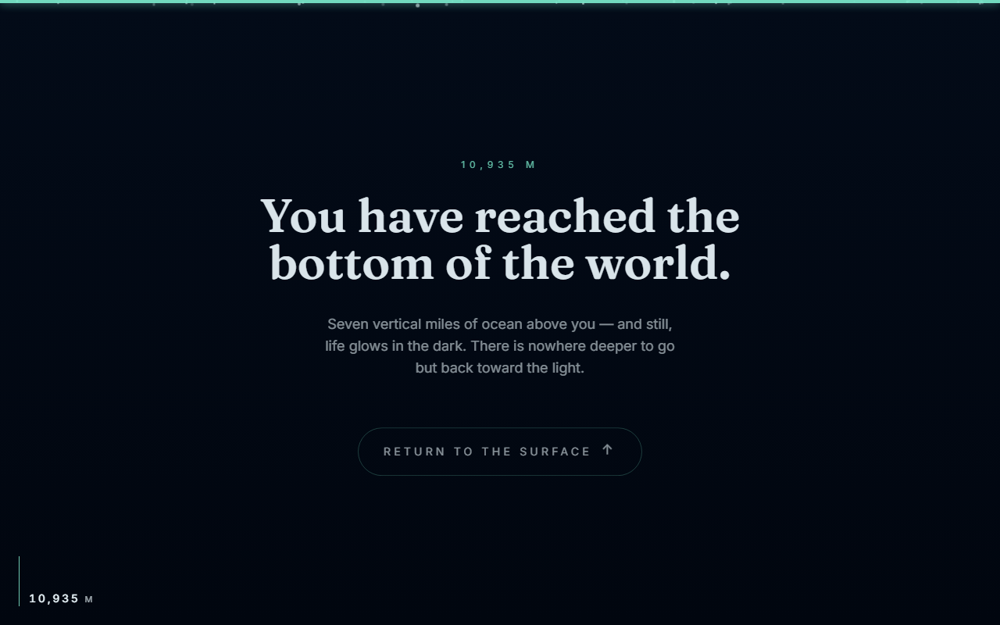

# Descent — a scroll-driven journey to the deep

An award-style, scroll-driven narrative site: one continuous long-scroll
experience that carries you from the sunlit ocean surface down to the hadal
trench, seven vertical miles below. Light fades, the palette darkens, a
submersible descends and morphs into native life, and the deepest creatures
drift past in a horizontal gallery.

Built with **React 18 + TypeScript (strict)**, **Vite**, **GSAP + ScrollTrigger**,
**Lenis** smooth scroll, and **Tailwind CSS**.



## The scroll

Six set-pieces, stitched into one uninterrupted descent:

| Zone | Depth | Technique |
| --- | --- | --- |
| **Hero** | Surface | Layered parallax + staggered type-in on load |
| **Twilight** | 200–1000 m | Pinned panel, scrubbed through three crossfaded beats |
| **Descent** | 1000–4000 m | Self-drawing SVG trail + continuous depth gradient |
| **Abyss** | 4000 m | A submersible that persists across the boundary and **morphs** into an anglerfish |
| **Hadal** | 6000 m+ | Horizontal-scroll creature gallery driven by vertical scroll |
| **Closing** | 10,935 m | Reveal-on-enter sign-off + scroll-to-top |

Throughout, ambient depth cues tie the zones together: a drifting **marine-snow**
particle field that fades in with depth, distant **bioluminescent creatures**
twinkling in the abyss, idle-floating gallery creatures, and a fixed
instrument-style **depth readout** that ticks from 0 to the bottom of the ocean.

<p align="center">
  
  
  
</p>
<p align="center">
  
  
  
</p>

> **Recording a walkthrough:** the stills above are captured by the Playwright
> suite. For a GIF/video, screen-record a top-to-bottom scroll of `pnpm dev`
> (e.g. macOS `⇧⌘5`, or `ffmpeg`/ScreenToGif) and drop it in `docs/media/`.

## Architecture

### Motion system

`src/lib/gsap.ts` is the single place GSAP and ScrollTrigger are imported and
registered. **Lenis** provides smooth scroll and is bridged to ScrollTrigger in
`src/hooks/useSmoothScroll.ts`: Lenis is driven from `gsap.ticker` (one rAF loop
for everything) and calls `ScrollTrigger.update` on every Lenis scroll. Under
reduced motion Lenis is skipped entirely and the page uses native scroll.

Every scene registers its ScrollTriggers inside a `gsap.context()` scoped to the
scene's root ref, so **all triggers and tweens are reverted on unmount** — no
leaks, no duplicates on resize (guarded by an E2E test that asserts
`ScrollTrigger.getAll().length` stays constant across repeated viewport changes).

### Pinning & scrubbing

The twilight section (`PinnedBeats`) pins its panel via
`ScrollTrigger { pin, scrub, end: '+=300%' }` and drives a timeline whose beats
crossfade as scroll scrubs through it, while a depth-gauge marker tracks
downward. The horizontal gallery (`HorizontalReef`) uses the same idea sideways:
pin the viewport and translate an inner track by `-(scrollWidth - innerWidth)`,
with `invalidateOnRefresh` so the distance re-measures on resize.

### The self-drawing path

`DescentPath` sets the SVG path's `strokeDasharray` to its measured
`getTotalLength()` and animates `strokeDashoffset` from full → 0 on scrub. A
glowing tip rides the drawing front by sampling `path.getPointAtLength()` each
frame, and depth captions reveal in sequence.

### The cross-section hand-off

The signature beat: a **single** submersible in a fixed overlay drifts down
across the descent → abyss boundary and cross-fades ("morphs") into an
anglerfish — machine giving way to native life. It is driven by **page-scroll
progress mapped to a band measured from the journey element**, deliberately
*not* by a ScrollTrigger whose trigger contains the pinned descent section
(which mis-measures the span and collapses the travel into a tiny window). The
band re-measures on refresh, so it stays correct across resizes.

### Continuous depth gradient

`DepthGradient` is a fixed, full-viewport background whose five zone layers
**cross-fade by opacity** (GPU-composited — no per-frame gradient repaint) as
overall scroll progresses, plus a surface light-glow that fades with depth.

## Reduced motion

`prefers-reduced-motion` is a first-class path, not an afterthought. A single
`usePrefersReducedMotion()` hook gates everything:

- Lenis is disabled (native scroll); no pins, no scrub, no parallax.
- The hero, beats, path and reveals render in their final state instantly.
- The pinned beats and horizontal gallery **linearise into readable vertical
  stacks** (via `motion-safe`/`motion-reduce` utilities) — nothing is clipped.
- The self-drawing path is shown fully drawn; the depth gradient holds a
  representative static state.
- The purely decorative travelling submersible is **omitted entirely** (there
  is no valid static position for a fixed overlay across a long page).
- Marine snow and the abyss bioluminescence render as a **static scatter** (no
  drift, no twinkle); the depth readout still ticks (a text update, not motion).

Content stays in logical DOM order and fully readable throughout. An E2E test
runs the whole page under `reducedMotion: 'reduce'` and asserts the key headings
are visible, the craft is hidden, and there are no console errors.

## Performance & accessibility

- Animations touch **only `transform` and `opacity`** — no layout thrash, no
  CLS. `will-change` is used sparingly on parallax layers.
- No raster images; all illustration is inline SVG. Fonts are self-hosted
  variable woff2 (Fraunces + Inter) via Fontsource with `font-display: swap`.
- Decorative SVG is `aria-hidden`; the descent trail carries an `aria-label`.
  Heading hierarchy is a single `h1` → section `h2`s → creature `h3`s.
- The hero text sits over a soft radial scrim so white-on-cyan meets contrast
  minimums without dulling the sunlit surface.
- The scroll-to-top CTA is a real, keyboard-focusable `<button>` with a visible
  focus ring.

## Develop

```bash
pnpm install
pnpm dev          # http://localhost:5176
pnpm build        # tsc -b && vite build
pnpm lint         # eslint, zero warnings
pnpm test:e2e     # Playwright scroll + screenshot + reduced-motion checks
```

> Uses **pnpm**. Dev server is fixed to **port 5176** (`strictPort`) so it can
> run alongside other local projects.

Implementation plan of record: [`docs/plans/2026-07-15-descent-scrollytelling.md`](docs/plans/2026-07-15-descent-scrollytelling.md).
